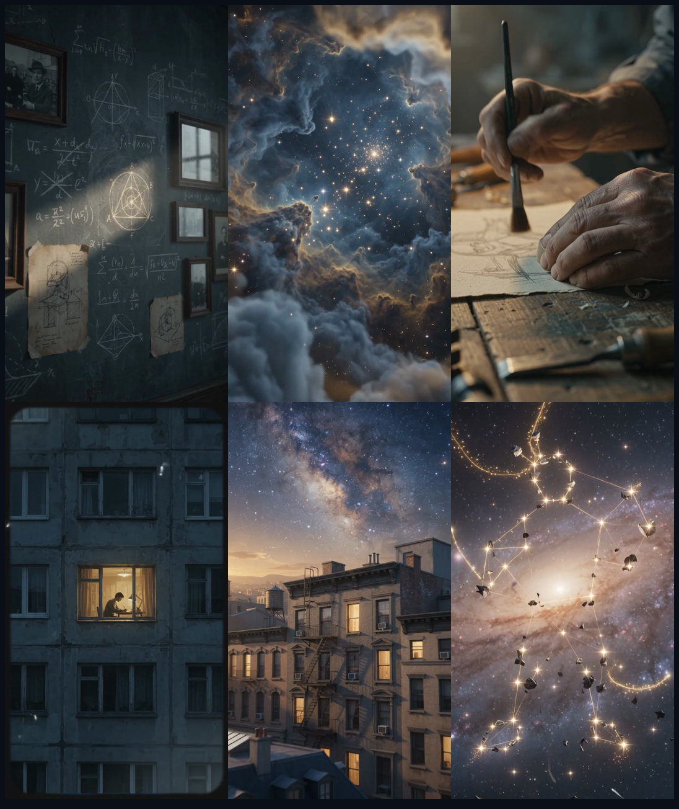

# Reel Studio — a worked example

Here's what a real run looks like, start to finish, so you can see what the skill actually
does before you install it.

**Input:** a ~66-second vertical clip of a founder being interviewed on stage, talking about
resilience and learning from failure — plus a transcript with timestamps. That's it.

**Output:** a 1080×1920 vertical reel where the interview audio drives everything, cinematic
AI B-roll plays over it, captions appear word-by-word in the brand font, the speaker cuts
back in split-screen on the emotional beats, and a film-grain pass ties it all together.

---

## How the conversation goes

You say something like *"make a vertical reel from this clip with cinematic B-roll and
captions."* Claude then walks the phases:

### 1 · Onboard (once per project)
Claude copies the Remotion template into your repo, reads your brand guide for colors, copies
your brand `.ttf`s into `public/fonts/`, and confirms the Higgsfield MCP is connected.

### 2 · Transcript → captions
`prep_source.sh` makes a muted speaker video + the audio track; `align_words.py`
(faster-whisper) produces **real** word-level caption timing — not guessed from the
transcript. Example cue that lands in `captions.json`:

```json
{ "start": 812, "end": 848, "words": [
  { "text": "keep",   "start": 812, "end": 823 },
  { "text": "getting", "start": 823, "end": 835 },
  { "text": "back",   "start": 835, "end": 842 },
  { "text": "up",     "start": 842, "end": 848 }
]}
```

The active word is accented in your brand color as it's spoken.

### 3 · Propose styles → you pick
Claude pitches a few distinct looks tied to the clip's emotional arc, e.g.:

- **Chalk & Cosmos** — slate-blue chalkboard dissolving into starfields; scholarly, reverent.
- **Warm archival** — sepia notebooks, film grain, golden halation; nostalgic and tender.
- **Cold-to-gold** — cold blue shadow with one hard shaft of light warming to dawn; defiant.

It generates a cheap sample still for each so you choose with your eyes, not blind.

### 4 · Shot list
The chosen style becomes a shared `STYLE` block appended to every prompt, so ten *different*
images still feel like one film. A single shot in `src/shots.ts` looks like:

```ts
{
  id: 5, file: "broll/clip5.mp4", start: 27, end: 33, mode: "split", push: "in",
  prompt:
    "A lone figure in silhouette rising from one knee in a dim room, a hard shaft of pale " +
    "light cutting the cold-blue dark, dust and breath visible in the air. " + STYLE,
}
```

- **Windows are contiguous** (each `end` = the next `start`) so there are no gaps.
- **`mode: "split"`** puts the speaker on top and this B-roll on the bottom for the beats
  where seeing the person adds weight — the personal, emotional lines.
- The **subject rotates** across clips (a study, a nebula, hands at a workbench, a lone
  silhouette, a lit window, a constellation) while the **mood stays constant**.

### 5 · Generate the clips
Claude generates each clip via the Higgsfield MCP in small batches, polls until done, pulls
the mp4s into `public/broll/`, and **checks the actual frames** (Higgsfield sometimes
false-flags dark/silhouette shots — the pixels are usually clean).

### 6 · Edit & render
```bash
npm run studio    # live preview — nudge split beats, caption timing, look
npm run render    # -> out/reel.mp4
```

---

## The result



<sub>*Six stills from the generated B-roll set — varied subjects, one unified mood.*</sub>

A finished vertical reel:

- **Full-frame cinematic B-roll** carrying the reflective and awe beats.
- **Split-screen** on the personal claims — speaker up top, matching B-roll below, a thin
  brand-accent divider between.
- **Word-synced captions** in your brand font, active word accented.
- **A grain/vignette unifier** so clips from ten different prompts (plus the real footage)
  read as one cinematic piece.

Everything after generation is a one-line edit + re-render — which clips split, the caption
look, the timing — so iterating is cheap. You spend Higgsfield credits only on generation,
and the skill previews with stills and checks cost before committing to a batch.
